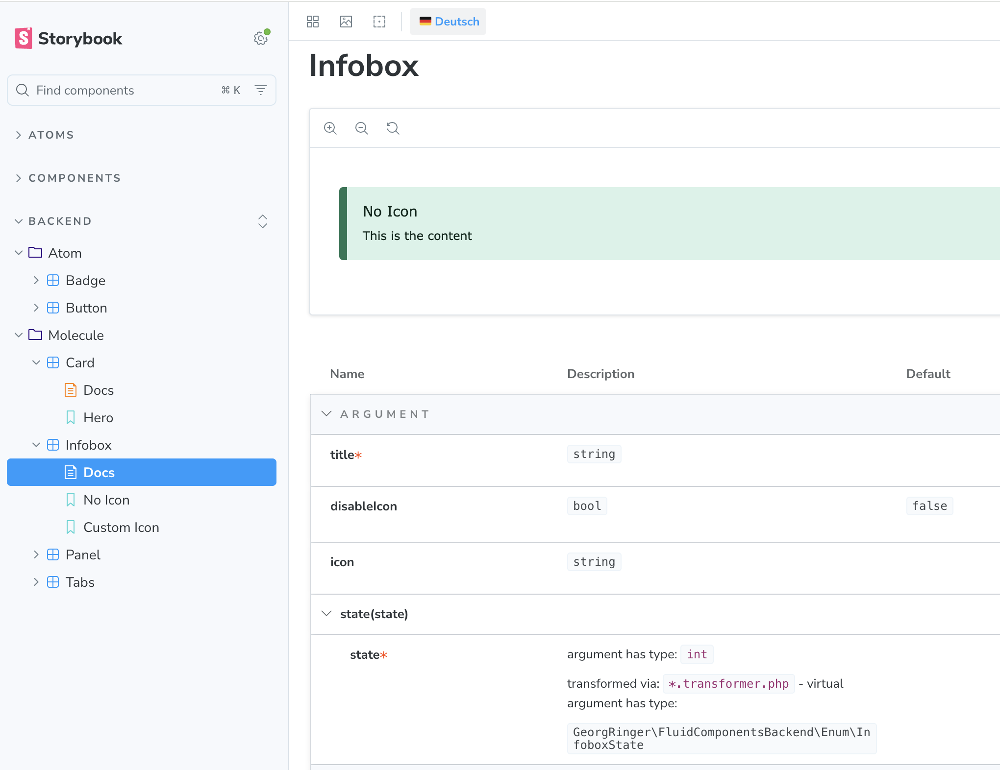

# TYPO3 Extension `fluid_components_backend`

This extension provides fluid components for the backend. This makes it faster and easier to generate e.g. previews for content elements.

## Usage
```bash
composer req georgringer/fluid-components-backend
```

Now you can use the components

### Tabs

```html
<fb:molecule.tabs>
    <f:fragment name="header">
        <fb:atom.tabHeader id="one" active="1" header="Tab #1" />
        <fb:atom.tabHeader id="two" header="Tab #2" />
    </f:fragment>
    <f:fragment name="content">
        <fb:atom.tabContent id="one" active="1" content="Lorem ipsum" />
        <fb:atom.tabContent id="two" content="Content #2" />
    </f:fragment>
</fb:molecule.tabs>
```

### Panel

```html
<fb:molecule.panel
    collapseIdentifier="c{item.uid}"
    title="My header">
    {content}
</fb:molecule.panel>
```

### Infobox

```html
<fb:molecule.infobox
    icon="actions-brand-typo3"
    title="Infobox">{content}</fb:molecule.infobox>
```

### Button

```html
<fb:atom.button>{cta.label}</fb:atom.button>
```

## Usage with storybook

Add the components to your `main.ts`, e.g. `'../vendor/georgringer/fluid-components-backend/.storybook/**/*.stories.ts'`


